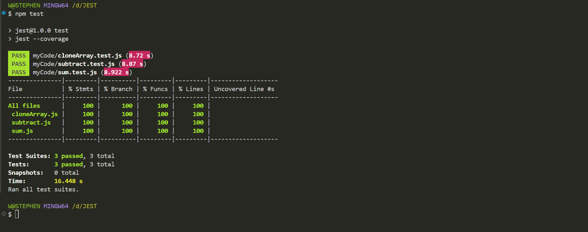

# My Project

## Description

This project demonstrates basic JavaScript functions for addition, subtraction and cloning an array tested using Jest. It contains simple test cases to verify the functionality of these operations.

## Getting Started

### Install the dependencies

`npm install`

### Tests

#### Test case 1

```test('adds 2 + 3 to equal 5', () => {
  expect(sum(2, 3)).toBe(5);
});

```

#### Test case 2

```test('subtracts 20 from 78 to equal 58', () => {
  expect(subtract(78, 20)).toBe(58);
});

```

### Test case 3

```const cloneArray = require ('./cloneArray');

test ('should check if array is cloned properly', () => {
  const array = [78, 34, 23];
  expect (cloneArray (array)).toEqual (array);
  // Checks is a new array was indeed created and not the same array
  expect (cloneArray (array)).not.toBe (array);
});```

### Package.json

```{
  "name": "jest",
  "version": "1.0.0",
  "main": "cloneArray.js",
  "scripts": {
    "test": "jest --coverage"
  },
  "keywords": [],
  "author": "",
  "license": "ISC",
  "description": "",
  "devDependencies": {
    "jest": "^29.7.0"
  }
}
```

### Terminal output

The `"test": "jest --coverage"` allows one to visualize what tests passed and which ones failed


